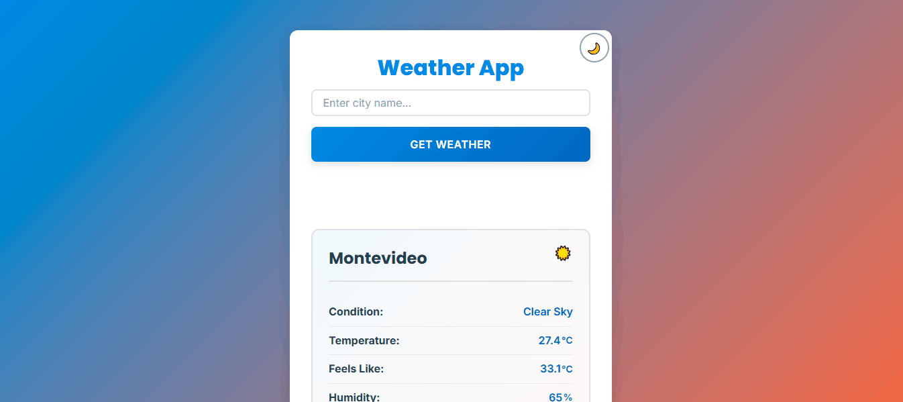

### Weather App

A modern, responsive weather application that fetches real-time weather data with professional error handling, retry logic, and a beautiful UI. Built with HTML, CSS & vanilla JS. This project demonstrates async/await patterns, API integration, and user-centric error handling.

## Features

**Real-time Weather Data** - Search any city and get current temperature, wind speed, local time, humidity, UV index and weather condition.
**Fully Responsive** - Mobile-first design that works perfectly on phones, tablets and desktops.
**Smart Retry Logic** - When errors occur, retry with edited input or the original search.
**Professional Error Handling** - User-friendly error messages that guide users to solutions.
**Request timeout protection** - API calls that exceed 10 seconds fail gracefully.
**Persistent storage** - App remembers your last searched city using localStorage.
**Beautiful spinner** - Modern SVG loading animation that feels polished and professional.
**Keyboard Support** - Press Enter to search, improving accessibility and user experience.

## Live Demo

**[Try it live on Netlify](https://weatherappuy.netlify.app/)**

## Screenshots


**Weather App showing real-time weather data for Montevideo city, Uruguay**

## Tech Stack

**Frontend** - HTML, CSS, JavaScript (Vanilla) | No frameworks, focused on core JS.
**API** - [Open-Meteo](https://open-meteo.com/) | Free, no API key required, reliable.
**Architecture** - Modular ES6 Modules, Clean separation: API, UI, Controller logic.
**Deployment** - Netlify | One-click deployment, CI/CD ready.

## What I learned

This project taught me professional JavaScript development practices:
**Async/Await & Promises** - Handling multiple API calls with proper error propagation.
**Error handling strategy** - Mapping technical errors to user-friendly messages.
**Timeout Logic** - Protecting users from hanging requests with Promise.race()
**State management** - Storing and managing "last attempted city" for retry functionality.
**User Experience** - Keeping error messages visible until user takes action (not clearing on keystroke).
**Code organization** - Separating concerns: API calls, UI updates, business logic.
**DOM manipulation** - Managing loading states, visibility classes and animations with vanilla JS.
**Accessibility** - Ensuring the app is accessible to users with disabilities.
**Semantic HTML** - Using semantic HTML elements to improve accessibility and SEO.

## Getting started

### Prerequisites

- **Browser** with ES6 module support (Chrome, Firefox, Safari, Edge).
- **Optional:** Live Server extension for IDE or Python for local server.

### Installation

```bash
# Clone the repository (when on GitHub)
git clone https://github.com/yourusername/weather-app.git
cd weather-app

# Or download and extract the ZIP file
```

### Running Locally

**Option 1: VS Code Live Server (easiest)**

1. Install [Live Server](https://marketplace.visualstudio.com/items?itemName=ritwickdey.LiveServer) extension
2. Right-click 'index.html' => 'Open with Live Server'
3. Browser opens automatically at 'http://localhost:5500'

**Option 2: Python (Built-in on Mac/Linux)**

```bash
# Navigate to the weather-app folder
cd weather-app

# Start a local server
python -m http.server 8000

# Open browser to http://localhost:8000
```

**Option 3: Node.js HTTP Server**

```bash
# Install http-server globally (one-time)
npm install -g http-server

# Run in the weather-app directory
http-server

# Open http://localhost:8080
```

## How to use

1. **Enter a city name** in the input field
2. **Click 'Get Weather'** or press **Enter**
3. **Loading spinner appears** while fetching data
4. **Weather data displays** (temperature, wind speed, time, etc)
5. **App saves your search** - next time you open the app, it loads that city's weather
6. **On error:** Click **Retry** to try again, or edit the city name and search

## Error scenarios

| Error             | Message                                                                | What to Do             |
| ----------------- | ---------------------------------------------------------------------- | ---------------------- |
| Invalid city name | " City not found. Please check the spelling and try again."            | Fix the spelling       |
| No internet       | " No internet connection. Please check your connection and try again." | Check WiFi/connection  |
| API timeout       | "Request timeout. Please check your connection and try again."         | Retry or wait a moment |
| Empty input       | " Please enter a valid city name."                                     | Type a city name       |

## Project structure

```
weather-app/
├── index.html          # HTML structure
├── style.css           # Responsive styles (mobile-first)
├── js/
│   ├── app.js          # Entry point, initializes app
│   ├── controller.js   # Business logic & error handling
│   ├── api.js          # API calls (geolocation & weather)
│   ├── ui.js           # DOM manipulation & state management
│   └── utils.js        # Helper functions (time formatting)
└── README.md           # This file
```

## How pieces talk to each other

User action (click button) => controller.js (handleWeatherRequest) => api.js (getCoordinates => getWeatherData) => Open-Meteo API (returns JSON) => controller.js (renderWeather) => ui.js (updateWeatherUI) => Browser displays weather.

## Future Improvements

These features would make the app even better:

**5-day Forecast** - Show upcoming weather predictions
**Favorite cities** - Save multiple cities for quick access.
**Temperature units** - Toggle between Celsius and Fahrenheit
**Geolocation** - Auto-detect user's location on first load

## Testing

To test error scenarios:

**1. Invalid city**
Input: 'Londondess' (typo)
Expected: 'City not found' error with retry button.

**2. Responsive Design**
Resize browser to 375px, 768px, 1440px.
Expected: Layout adapts perfectly at each breakpoint

**3. Retry logic**

1. Search 'Londondess'
2. Get error
3. Edit input to 'London'
4. Click Retry
   Expected: Searches for 'London', not 'Londondess'

**4. Persistent storage**

1. Search 'Paris'
2. Close browser tab
3. Reopen website
   Expected: weather for 'Paris' loads automatically

## Browser Support

- Chrome 55+
- Firefox 52+
- Safari 10.1+
- Edge 15+
- Mobile browsers (iOS Safari, Chrome mobile)

## License

This project is open source under the **MIT License** - feel free to use it as a template or reference.

## Acknowledgments

**Open-Meteo** for the free, reliable weather API
**MDN Web Docs** for JavaScript and CSS documentation
**Inspired by professional error handling and UX best practices**

**Built with love as a junior developer apprentice**

Questions or feedback? Open an issue or reach out!
