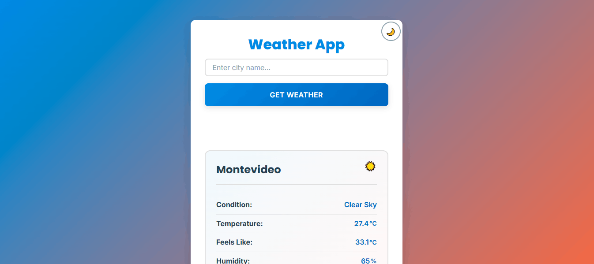

# Weather App

A modern, responsive weather application that fetches real-time weather data with professional error handling, retry logic, and a clean SVG icon system. Built with HTML, CSS & vanilla JS. This project demonstrates async/await patterns, API integration, modular architecture, and user-centric error handling.

## Features

**Real-time Weather Data** - Search any city and get current temperature, wind speed, local time, humidity, UV index and weather condition.
**Fully Responsive** - Mobile-first design that works perfectly on phones, tablets and desktops.
**Smart Retry Logic** - When errors occur, retry with edited input or the original search.
**Professional Error Handling** - User-friendly error messages that guide users to solutions.
**Request Timeout Protection** - API calls that exceed 10 seconds fail gracefully.
**Persistent Storage** - App remembers your last searched city using localStorage.
**SVG Icon System** - Weather conditions and UI controls use Lucide SVG icons for crisp, scalable visuals at any resolution.
**Beautiful Spinner** - Custom SVG loading animation that feels polished and professional.
**Dark Mode** - Toggle between light and dark themes, with preference saved across sessions.
**Keyboard Support** - Press Enter to search, improving accessibility and user experience.

## Live Demo

**[Try it live on Netlify](https://weatherappuy.netlify.app/)**

## Screenshots


**Weather App showing real-time weather data for Montevideo, Uruguay**

## Tech Stack

**Frontend** - HTML, CSS, JavaScript (Vanilla) | No frameworks, focused on core JS.
**Icons** - [Lucide](https://lucide.dev/) | Loaded via ESM import map, pinned to a specific version for stability.
**API** - [Open-Meteo](https://open-meteo.com/) | Free, no API key required, reliable.
**Architecture** - Modular ES6 Modules | Clean separation across API, UI, controller, and icon logic.
**Deployment** - Netlify | CI/CD ready.

## What I learned

This project taught me professional JavaScript development practices:

**Async/Await & Promises** - Handling multiple API calls with proper error propagation.
**Error Handling Strategy** - Mapping technical errors to user-friendly messages.
**Timeout Logic** - Protecting users from hanging requests with Promise.race().
**State Management** - Storing and managing "last attempted city" for retry functionality.
**User Experience** - Keeping error messages visible until the user takes action.
**Code Organization** - Separating concerns: API calls, UI updates, icon logic, business logic.
**SVG Icon Architecture** - Building a reusable icon module with Lucide ESM, using an import map to manage the dependency cleanly without a bundler.
**DOM Manipulation** - Managing loading states, visibility classes and animations with vanilla JS.
**Accessibility** - Semantic HTML, aria attributes, skip links and keyboard navigation.
**Dark Mode** - Implementing theme toggling with CSS custom properties and localStorage persistence.

## Getting Started

### Prerequisites

- **Browser** with ES6 module support (Chrome, Firefox, Safari, Edge).
- **Optional:** Live Server extension for VS Code or Python for a local server.

### Installation

```bash
# Clone the repository
git clone https://github.com/Dev-Gus/weatherappuy.git
cd weatherappuy
```

### Running Locally

**Option 1: VS Code Live Server (easiest)**

1. Install the [Live Server](https://marketplace.visualstudio.com/items?itemName=ritwickdey.LiveServer) extension
2. Right-click `index.html` → Open with Live Server
3. Browser opens automatically at `http://localhost:5500`

**Option 2: Python**

```bash
cd weatherappuy
python -m http.server 8000
# Open http://localhost:8000
```

**Option 3: Node.js**

```bash
npm install -g http-server
http-server
# Open http://localhost:8080
```

## How to Use

1. **Enter a city name** in the input field
2. **Click "Get Weather"** or press **Enter**
3. **Loading spinner appears** while fetching data
4. **Weather data displays** with condition icon, temperature, wind speed, humidity and more
5. **App saves your search** — next visit loads that city automatically
6. **On error:** click **Retry** to try again, or edit the city name and search

## Error Scenarios

| Error             | Message                                                       | What to Do            |
| ----------------- | ------------------------------------------------------------- | --------------------- |
| Invalid city name | City not found. Please check the spelling and try again.      | Fix the spelling      |
| No internet       | No internet connection. Please check your connection.         | Check WiFi/connection |
| API timeout       | Request timed out. Please check your connection and try again.| Retry or wait         |
| Empty input       | Please enter a valid city name.                               | Type a city name      |

## Project Structure

```
weatherappuy/
├── index.html           # HTML structure and import map
├── style.css            # Responsive styles, dark mode, animations
├── js/
│   ├── app.js           # Entry point — initializes theme and app
│   ├── controller.js    # Business logic and error handling
│   ├── api.js           # API calls (geocoding and weather)
│   ├── ui.js            # DOM manipulation and state management
│   ├── icons.js         # Lucide icon factory and WMO code mapping
│   └── utils.js         # Helper functions (time formatting, weather warnings)
└── README.md
```

## How the Pieces Talk to Each Other

```
User action (click / Enter)
  → controller.js (handleWeatherRequest)
    → api.js (getCoordinates → getWeatherData)
      → Open-Meteo API (returns JSON)
    → icons.js (getWeatherIcon → createIcon)
    → ui.js (updateWeather, updateWeatherIcon)
      → Browser renders weather card
```

## Future Improvements

**5-day Forecast** - Show upcoming weather predictions.
**Favorite Cities** - Save multiple cities for quick access.
**Temperature Units** - Toggle between Celsius and Fahrenheit.
**Geolocation** - Auto-detect user location on first load.

## Testing

**1. Invalid city**
Input: `Londondess` (typo)
Expected: "City not found" error with retry button.

**2. Responsive Design**
Resize browser to 375px, 768px, 1440px.
Expected: Layout adapts cleanly at each breakpoint.

**3. Retry Logic**
1. Search `Londondess`
2. Get error
3. Edit input to `London`
4. Click Retry
Expected: Searches for `London`, not `Londondess`.

**4. Persistent Storage**
1. Search `Paris`
2. Close the browser tab
3. Reopen the app
Expected: Weather for Paris loads automatically.

**5. Dark Mode**
Toggle theme, close tab, reopen.
Expected: Theme preference is preserved.

## Browser Support

- Chrome 55+
- Firefox 52+
- Safari 10.1+
- Edge 15+
- Mobile browsers (iOS Safari, Chrome for Android)

## License

MIT License — feel free to use this as a reference or template.

## Acknowledgments

**Open-Meteo** for the free, reliable weather API.
**Lucide** for the clean, consistent SVG icon library.
**MDN Web Docs** for JavaScript and CSS reference.